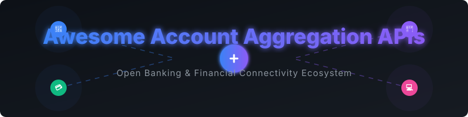

  

# Awesome Account Aggregation API 🏦

## Similar Projects to Account Aggregation APIs

**Account Aggregation APIs** (also called open banking, financial data aggregation, or bank connectivity platforms) allow applications to securely access users’ bank account data, balances, transactions, and in many cases initiate payments, with user consent. Leading commercial providers include Plaid, Tink, Finicity, TrueLayer, Yodlee, Belvo, Salt Edge, MX, Akoya, and Mono.

Below is a **curated list** of notable platforms and their open-source equivalents. True end-to-end open-source alternatives with broad, production-ready bank coverage are rare because of regulatory requirements (PSD2/Open Banking licenses, eIDAS certificates, bank partnerships) and the ongoing cost of maintaining connectors. Most open-source efforts focus on API platforms for banks, connector frameworks, or personal-finance tools that can sit on top of commercial aggregators.

## 🏢 SaaS / Hosted Platforms

| Platform | Description | Company Size (Valuation / Revenue) | Pricing & Free Tier |
| :--- | :--- | :--- | :--- |
| **[Plaid](https://plaid.com/)** | Dominant US-focused account aggregation and payment platform with extensive bank coverage and developer tools. | $8.0 Billion (Valuation) | Custom usage-based. Offers free sandbox environment and trial plan (up to 10 free connections). |
| **[Tink](https://tink.com/)** (Visa) | Leading European open banking platform for account information and payment initiation. | $2.2 Billion (Acquisition value) | Custom usage-based. Offers free developer console and sandbox testing. |
| **[MX](https://www.mx.com/)** | US-focused data aggregation, enrichment, and analytics platform popular with banks and fintechs. | $1.9 Billion (Valuation) | Custom subscription/usage. MX Data Access tool is free for financial institutions; free demo available. |
| **[Finicity](https://www.finicity.com/)** (Mastercard) | US financial data aggregation and verification platform. | $825 Million (Acquisition value) | Custom usage-based. Offers free "Test Drive" sandbox environment. |
| **[TrueLayer](https://truelayer.com/)** | Strong UK and European open banking provider specializing in payments and account data. | $750 Million (Valuation) | Custom tiered. Offers free development/sandbox environment for testing. |
| **[Yodlee](https://www.yodlee.com/)** (Envestnet) | Long-standing global financial data aggregation platform. | $590 Million (Acquisition value) | Custom enterprise. Offers free sandbox environment for developer testing. |
| **[Belvo](https://belvo.com/)** | Leading open banking / account aggregation platform focused on Latin America. | $80 Million+ (Total funding) | Custom usage-based. Free sandbox and developer dashboard access. |
| **[Mono](https://mono.co/)** | Open banking and account aggregation platform focused on Africa. | $30 Million (Acquisition value) | Custom/usage-based. Offers free developer sandbox for testing. |
| **[Salt Edge](https://www.saltedge.com/)** | Global open banking aggregator with wide geographic coverage. | $3 Million+ (Total funding) | Custom based on modules. Developer portal with sandbox access is available. |
| **[Akoya](https://akoya.com/)** | Bank-owned data access network in the US aimed at secure, permissioned data sharing. | Undisclosed (Bank-backed network) | Custom enterprise/network fees. Developer portal for sandbox/test integrations. |

## 🔓 Open-Source Software

Here is a list of notable open-source repositories in the account aggregation and open banking ecosystem, sorted by GitHub star count:

- **[Actual Budget](https://github.com/actualbudget/actual)**  — Popular open-source personal finance manager (formerly commercial) with local-first architecture and support for bank syncing.
- **[Firefly III](https://github.com/firefly-iii/firefly-iii)**  — Popular open-source personal finance manager. Can import transactions and, via community integrations or commercial aggregators, support bank connectivity.
- **[Open Bank Project (OBP-API)](https://github.com/OpenBankProject/OBP-API)**  — The most established open-source open banking API platform. Enables banks and fintechs to expose accounts, transactions, payments, and consents via standardized RESTful APIs (supports PSD2, Open Banking, and Open Finance styles). Actively maintained and used in production by multiple institutions.
- **[Open Banking Connector](https://github.com/finlabsuk/open-banking-connector)**  — Open-source connector layers that simplify integration with UK/EU Open Banking APIs by handling bank differences, registrations, and tokens.

### Protocols, Standards & Adjacent Tools
- **SimpleFIN** — Lightweight, read-only financial data protocol (more common in certain US personal-finance contexts).
- **Enable Banking** related open-source components — Tools and samples for working with eIDAS certificates and PSD2-style bank APIs.
- **OpenFinance** — Emerging projects that normalize data from commercial providers (Plaid, MX, etc.) and expose it via APIs or MCP for AI agents (still relies on underlying commercial aggregators).

### Typical Open-Source / Hybrid Approach
Because full bank coverage is difficult to maintain in pure open source, common patterns include:
1. Using a commercial aggregator (Plaid, Tink, TrueLayer, etc.) for bank connectivity.
2. Normalizing and storing the data in a self-hosted system (Firefly III, custom database, or Open Bank Project-style API).
3. Building internal or customer-facing experiences on top of the normalized data.
4. For banks themselves: deploying Open Bank Project or similar to expose their own APIs in a standards-compliant way.

Pure self-hosted aggregation with broad live bank coverage remains limited; most production systems combine open-source components with regulated commercial connectivity providers.

---

**How to contribute**  
Fork this repository, add a new project (with link + short description + category), and open a pull request.  
Prefer actively maintained open-source projects related to open banking, account aggregation, financial data APIs, or personal finance platforms that support bank connectivity.

**License**  
This list is public domain / CC0. Feel free to copy into your own awesome list or README.

Star the projects you find useful — open banking and financial data infrastructure continues to evolve! 🏦
